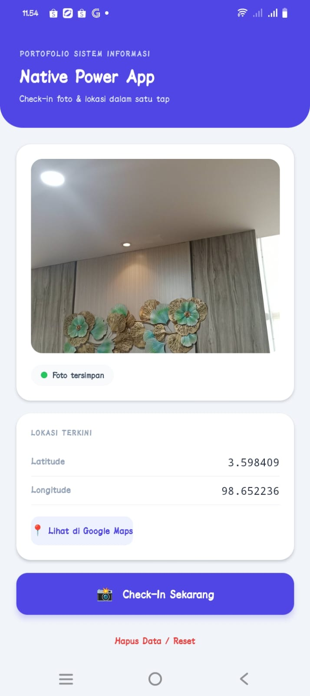
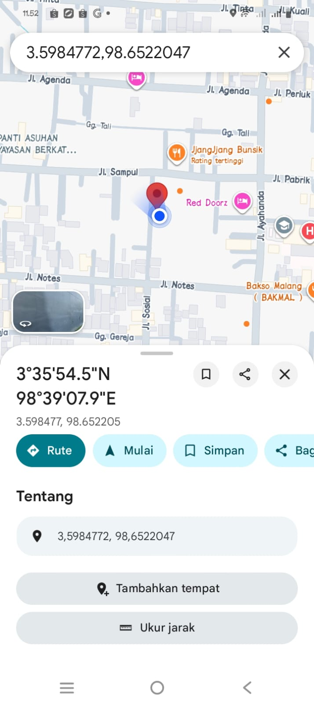

# Native Power App 🚀

Aplikasi check-in sederhana berbasis **React Native (Expo)** untuk tugas Pemrograman Mobile. Aplikasi ini bisa mengambil foto dan mengunci lokasi GPS secara bersamaan.

## ✨ Fitur
* 📸 **Kamera & Galeri:** Bisa ambil foto langsung atau pilih dari galeri.
* 📍 **GPS Lokasi:** Mencatat koordinat Latitude & Longitude saat foto diambil.
* 💾 **Penyimpanan Lokal:** Data otomatis tersimpan (tidak hilang saat aplikasi ditutup).
* 🗺️ **Buka Google Maps:** Ada tombol untuk melihat lokasi langsung di Google Maps.
* ❌ **Reset:** Tombol untuk menghapus foto dan lokasi kembali ke awal.

## 📸 Dokumentasi
##Tampilan awal

##Input gambar

##Letak lokasi di google maps

## Link Snack 
[Link anack](https://snack.expo.dev/@stephanizz/native-power-app)
